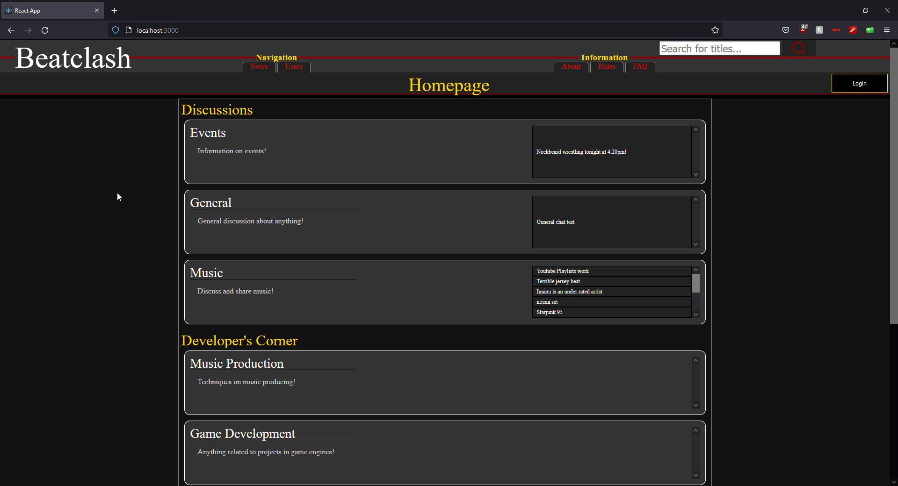
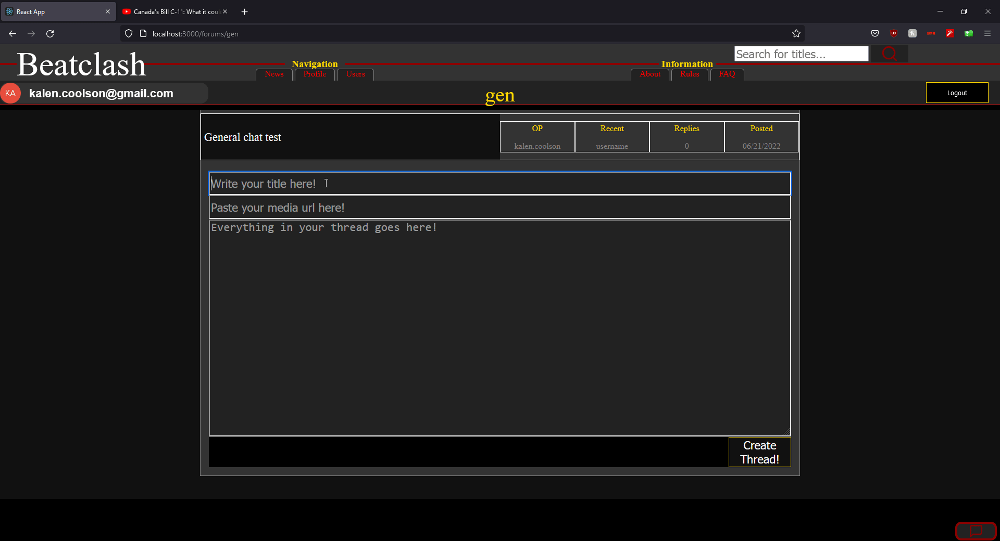
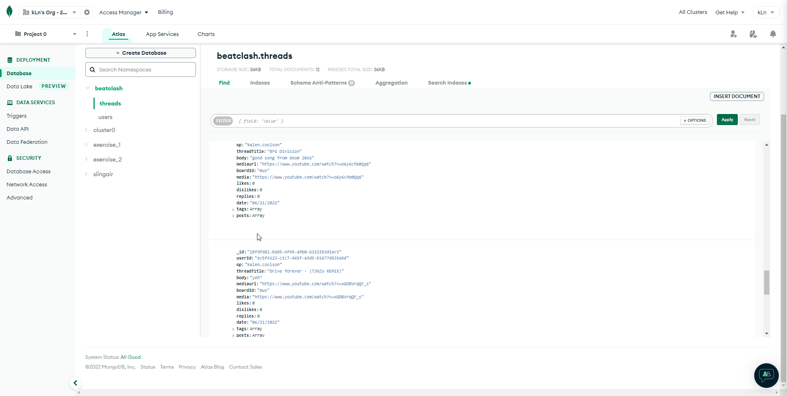
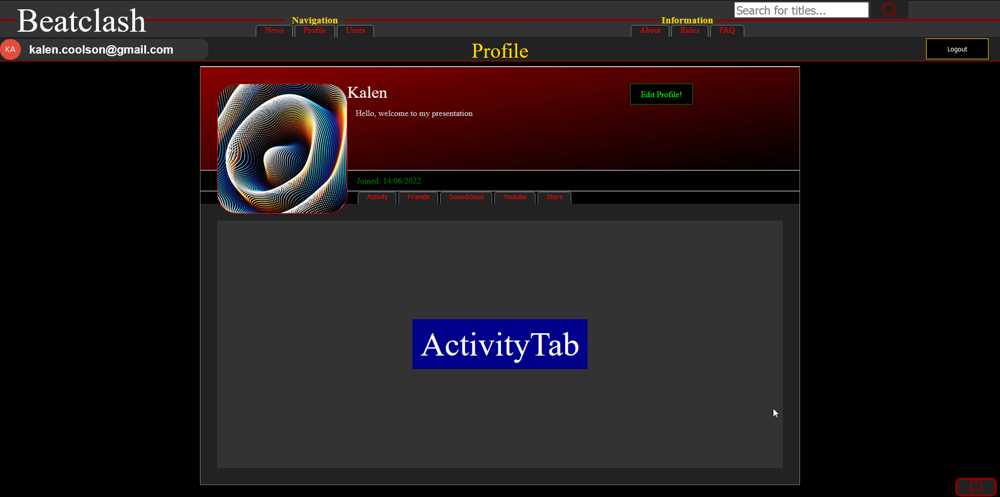
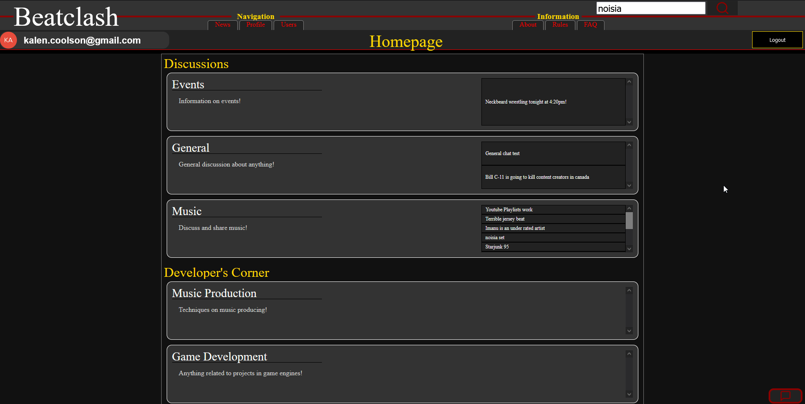

# Beatclash
My final project. A forum for music producers, DJs, and content creators.

## About
The aim of this project was to create a forum that would allow users to share content they have been working on. There are also boards for current events, non-user created music, and general discussion.

## Homepage
Lists all the boards, and threads

## Posting threads
Ability to create, and reply to threads

## Mongodb
All threads and posts are stored on the database

## Profiles
All profiles are stored on the database as well

## Search
There is built in search functionality to find threads by title

## Current Functionality:
* Basic forum with boards, where users can make and reply to threads.
* Uploading of videos and music using React-Player.
* Auth0 login.
* Editable user profiles, and avatars.
* Search by thread titles.

## React-Player's Accepted Web Formats
* Youtube
* Soundcloud
* Facebook
* Vimeo
* Twitch
* Streamable
* Wistia
* DailyMotion
* Mixcloud
* Vidyard
* Kaltura

## React-Player's Accepted File Formats
* .mp4
* .webm
* .ogv
* .mp3
* .HLS(m3u8)
* .DASH(mpd)